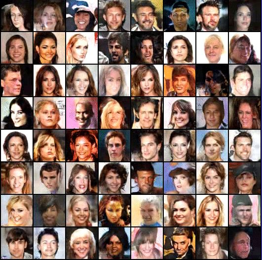

# fake_faces_DCGAN

# Architecture of the Model

The core to the DCGAN architecture uses a standard CNN architecture on the discriminative model. For the generator, convolutions are replaced with upconvolutions, so the representation at each layer of the generator is actually successively larger, as it mapes from a low-dimensional latent vector onto a high-dimensional image.

Use batch normalization in both the generator and the discriminator.

Remove fully connected hidden layers for deeper architectures.

Use ReLU activation in generator for all layers except for the output, which uses Tanh.

Use LeakyReLU activation in the discriminator for all layers.

 <h1> Datasets</h1>
  
<b>Celeba-dataset :</b> https://www.kaggle.com/jessicali9530/celeba-dataset 

  
<b>Faces-data-new :</b> https://www.kaggle.com/gasgallo/faces-data-new 

 <h1>Fake faces or Generated faces</h1>
 

